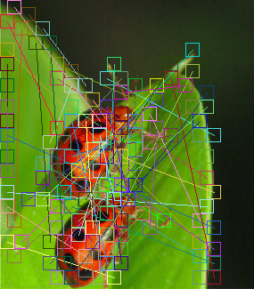

# Image Forensics

A Rust library for performing digital image forensics. This crate provides a collection of tools and algorithms to detect manipulations, forgeries, and inconsistencies in images, such as tampering, splicing, copy-move forgeries, and more.

> **These are investigative signals, not verdicts.** Every module reports a score derived from heuristics with hand-chosen thresholds. Ordinary processing — resaving a JPEG, resizing for the web, a phone's own noise reduction — trips most of them. Treat a result as a pointer to a region worth examining, and weight *agreement across independent modules* over any single score.

## Features

| Module | Description |
|--------|-------------|
| **Benford's Law Analysis** | Detects anomalies in the distribution of leading digits in DCT coefficients, which can indicate compression or manipulation. |
| **CFA (Color Filter Array) Analysis** | Examines demosaicing patterns to identify inconsistencies from editing tools. |
| **Chromatic Aberration Analysis** | Fits a radial lens-dispersion model and flags regions that break it. |
| **Copy-Move Detection** | Identifies duplicated regions within an image, a common forgery technique. |
| **DCT (Discrete Cosine Transform) Analysis** | Inspects JPEG compression artifacts in the frequency domain. |
| **ELA (Error Level Analysis)** | Highlights areas with different compression levels, revealing edits. |
| **Histogram Analysis** | Finds the combs, gaps and clipping left by levels and curves adjustments. |
| **JPEG Analysis** | Quality estimation, JPEG ghost detection and blocking-grid analysis. |
| **Luminance Gradient Analysis** | Checks for lighting inconsistencies via gradient maps. |
| **Noise Analysis** | Examines noise patterns for irregularities caused by manipulation. |
| **PCA (Principal Component Analysis)** | Flags patches that reconstruct poorly from the image's own principal subspace. |
| **PRNU (Photo Response Non-Uniformity) Analysis** | Uses sensor noise fingerprints to verify image authenticity. |
| **Resampling Detection** | Detects the periodic interpolation residue left by scaling or rotation. |
| **Shadow Analysis** | Detects inconsistencies in shadows and lighting directions. |
| **Splicing Detection** | Identifies composited elements from different sources. |
| **Tampering Detection** | General-purpose detection of image alterations. |
| **Metadata Analysis** | Extracts and analyzes EXIF metadata for tampering clues. |

## Installation

Requires Rust 1.85 or newer (edition 2024). There are no system dependencies.

Add this crate to your `Cargo.toml`:

```toml
[dependencies]
image-forensics = { git = "https://github.com/Molcarrus/image-forensics.git" }
image = "0.25"
```

Note: Since this is a Git dependency, you can also clone the repository and build it locally.

## Usage

### Basic Example

```rust
use image_forensics::{analysis::copy_move::CopyMoveDetector, error::Result};

fn main() -> Result<()> {
    // Load the image
    let image = image::open("evidences/copy_move.png")?;

    let copy_move_detector = CopyMoveDetector::new(
        16,   // block_size (4..=64)
        0.92, // similarity_threshold
        50,   // min_distance in pixels
    )?;

    // `detect` runs the analysis
    let copy_move_result = copy_move_detector.detect(&image)?;

    // Save the output analysis image
    copy_move_result.visualization.save("output/copy_move_result.png")?;

    println!("Matching regions found: {}", copy_move_result.matches.len());
    println!("Confidence: {:.1}%", copy_move_result.confidence * 100.0);

    if !copy_move_result.matches.is_empty() {
        println!("Detected matches:");

        for (i, match_pair) in copy_move_result.matches.iter().enumerate() {
            println!(
                "{}. Source ({}, {}) -> Target ({}, {}) | Similarity: {:.1}%",
                i + 1,
                match_pair.source.x,
                match_pair.source.y,
                match_pair.target.x,
                match_pair.target.y,
                match_pair.similarity * 100.0,
            );
        }
    }

    Ok(())
}
```

### Combined analysis

```rust
use image_forensics::{ForensicsAnalyzer, error::Result};

fn main() -> Result<()> {
    let report = ForensicsAnalyzer::new("evidences/splicing.png")?.full_analysis()?;

    println!("Tampering probability: {:.1}%", report.tampering_probability * 100.0);
    println!("Copy-move matches:     {}", report.copy_move.matches.len());
    println!("Noise inconsistency:   {:.2}", report.noise.inconsistency_score);

    Ok(())
}
```

#### Example Output



## Documentation

Full documentation lives in `docs/`, built with [Cobalt](https://cobalt-org.github.io/):

```bash
cd docs
cobalt serve
```

It covers installation, configuration, an API reference, and a page per module
describing what each method detects — and, importantly, what benign processing
triggers it.

## Dependencies

`image`, `imageproc`, `kamadak-exif`, `ndarray`, `rayon`, `serde`, `serde_json`
and `thiserror`. All pure Rust; no BLAS, OpenCV or other system libraries.

## Building and Testing

```bash
git clone https://github.com/Molcarrus/image-forensics.git
cd image-forensics
cargo build
cargo test
cargo clippy --all-targets
```

### Running the examples

The examples read from `evidences/` and write to `output/`. Both directories are
gitignored, so supply your own images and create the output directory first:

```bash
mkdir -p output
cargo run --release --example copy_move
```

Use `--release`: these are dense numeric loops and a debug build is roughly ten
times slower.

Available examples: `benford_analysis`, `cfa_analysis`, `chromatic_aberration`,
`copy_move`, `dct_analysis`, `ela_analysis`, `histogram_analysis`,
`pca_analysis`, `prnu_analysis`, `resampling_analysis`, `shadow_analysis`,
`splicing_detection`.

## Contributing

Contributions are welcome! Please open an issue or submit a pull request for bug fixes, new features, or improvements.

`cargo test` and `cargo clippy --all-targets` are both currently clean; please
keep them that way.
